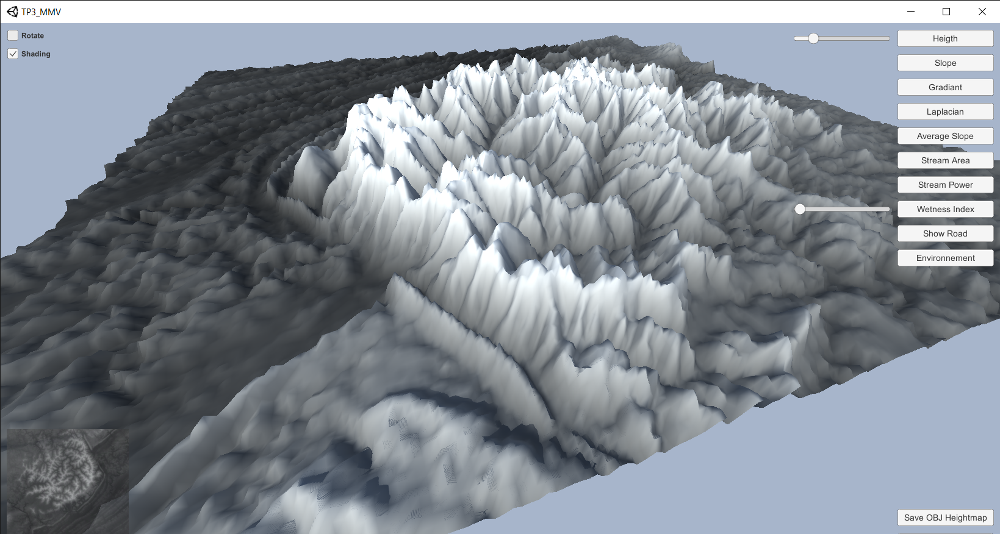

# HeightMapViewer
A simple height map viewer made in Unity.

## Description

This application have been made for the "Modelisation de monde virtuel" (Virtual World Modelisation) course in University Claude Bernard in Lyon, France.  

It allows to display a map imported frow a greyscale PNG image.

## Prerequisites

This application have been made using 
- Unity 2020.2.6f1
- Visual Studio Code with C# and and Debugger for Unity extensions.
- UnityStandaloneFileBrowser Package from gkngkc for file operations.

### Features

- Change the height of the rendered map
- Display different values directly on the map like the sope, gradiant, laplacian, stream areas, etc...
- Display an adapted road between two points using Left/Right clicks on the minimap in the corner (CAREFUL : Can be hella slow)
- Import a new map using a PNG image
- Export the map to a OBJ FIle (CAREFUL : Bloody slow, even worse that the road thing)

## Screenshots

## Useful links

- [Unity3D](https://unity.com)
- [Visual Studio Code](https://code.visualstudio.com)
- [UnityStandaloneFileBrowser](https://github.com/gkngkc/UnityStandaloneFileBrowser) from [gkngkc](https://github.com/gkngkc)
